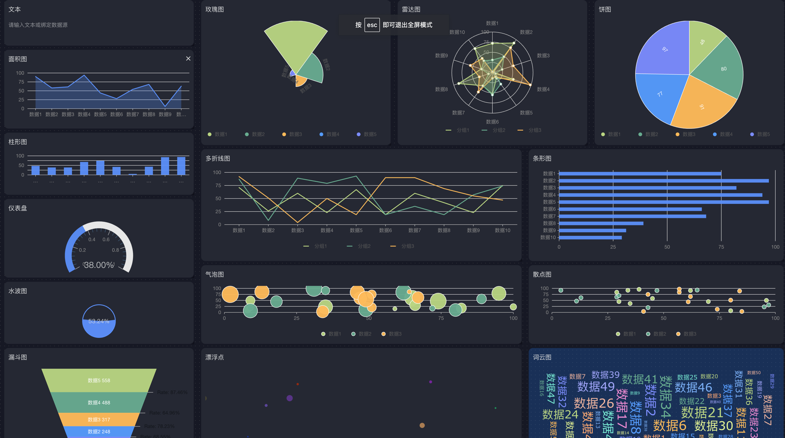

[中文](README.md) / English

## about

neatlogic-dashboard is a dashboard module of neatlogic, which supports setting a dashboard as the default home page.

## Features

### Rich built-in components

- Support black and white skins
  
  

### Custom Components

- Write custom components in a low-code way
  